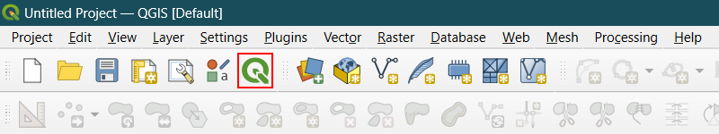

| [fair-software.eu](https://fair-software.eu) recommendations | |
| :-- | :--  |
| (1/5) code repository     |  |
| (2/5) license             |  |
| (3/5) community registry  |  |
| (4/5) citation            |  |
| (5/5) checklist           |  |

# QGIS Light

QGIS made simple - a light user interface for core GIS functions.

QGIS is a great GIS software loaded with a lot of data visualization and
analysis capabilities. This makes it a suitable tool for GIS experts and alike.
But QGIS is also used by a large group of less technical people, and it is not
uncommon that they encounter difficulties in using the "complex" interface of
QGIS that is full of toolbars, panels, and processing algorithms.

QGIS Light plugin aims to facilitate getting a simple QGIS interface, that is
tailored to the needs of basic users. Our starting point was to support
secondary education and citizen science activities. But a basic interface might
also be useful for anybody that requires core data visualization, editing, and
analysis functionality.

## How to simplify the QGIS interface?

> [!NOTE]
> For the first time you try the plugin, we suggest you to
> [create a profile](https://docs.qgis.org/latest/en/docs/user_manual/introduction/qgis_configuration.html#working-with-user-profiles)
> and use it before activating the plugin. If something goes wrong, you can
> switch to the default profile to revert changes.

- Install QGIS Light by using the plugin manager.

- Once installed, you will see a tool button with a plain green QGIS logo added
  to the project toolbar. A menu item is also added to the view menu as 'Toggle
  QGIS Light'.

  

  

- Clicking the tool button or selecting the menu item will enable the light mode.

  

- To return back to the standard interface, click the tool button with a colored
  QGIS logo located on the top menu bar.

  

## What is the scope of the simplifications?

The target group we considered for the simplifications is follows:

- Users will use local data files or connect to remote data stores via web
  services (no (direct) database use).
- Users will use 2d vector and raster data (no z and m values, no 3d, no point
  clouds, mesh, etc.)
- Users will work with a single map at a time (no multiple map canvases).
- Users will not require to publish high-quality maps (no layouts).
- Users will not require advanced analysis capabilities (no model building, no
  advanced tools).
- Users will require base maps (common base maps, e.g. OpenStreetMap, should be
  available).
- Users will create plots (plots should be created easily).

## What are the simplifications?

We checked all menus, toolbars, panels, and processing algorithms in detail to
identify non-essential or duplicated components. We grouped remaining essential
components for better usability.

The following simplifications are performed by the plugin:

- No menu bar.

  All necessary menu items are provided as tool buttons.

- Less toolbars.

  The number of toolbars is reduced to two, one for core functions and another
  one for editing. Common functions (e.g. zoom, select) are grouped and made
  available through dropdown tool buttons.

- Less panels.

  Only two panels are made visible, overview and layers. The rest are hidden
  and became visible only if they are needed (i.e. a related function is
  requested).

- Fixed layout of the toolbars and panels.

  It is not possible to move or float toolbars and panels. This is to ensure
  the same user experience among the users, which is especially important when
  e.g. training non-technical users.

- No processing toolbox.

  All essential processing algorithms are accessible via dropdown tool buttons.
  The current list of algorithms is rather draft and will be finalized soon
  basedcon the [analysis document](docs/qgis-processing-algorithms.xlsx)
  available under the documentation directory.

- Less features.

  The following functions are hidden from the user:

  - SQL functions
  - Z/M functions
  - Database functions
  - TIN functions
  - Mesh functions
  - Tile functions
  - Curve functions
  - GPS functions
  - Cartography functions
  - Random functions
  - Fuzzify functions
  - Modeler tools functions
  - GRASS functions
  - PDAL functions

- Additional featues.

  The following functions are added for a better user experience:

  - Plot functions are replaced with .

    DataPlotly enables changing plotting options easily (e.g. colors), provides
    more plot types, integrates with the map canvas (i.e., plots are dynamically
    updated based on the selected features), and most importantly gets rid of
    opening an external file to access the plot (i.e. no external HTML file).

  - Common base maps are provided by using .

    QuickMapServices provides a large set of base maps that can be added as
    layers easily.

Most of the simplifications listed above can be customized by editing the
[`config.json`](src/qgis-light/config.json) file located under the plugin
source code directory.

## Why there is a need for a plugin for the simplifications?

QGIS offers options for user interface customization, such as `Interface
Customization...` dialog that allows users to remove interface components they
are not interested in.
There is also the [CustomToolBar](https://github.com/All4Gis/CustomToolBar)
plugin available to create custom toolbars by using the existing tools.
However, any further customization, such as creating dropdown tool buttons,
requires custom scripting.

## What else can be simplified?

Probably many other components. It is not exhaustive, but while working on
the plugin we identified a list of issues that hinder better user experience,
such as inconsistent terminology, similar tools with different set of
parameters, tools with very similar names but performing different tasks, tools
that might be easily incorporated in e.g. raster calculator, etc.

You can check the slides of our QGIS User Conference 2024 talk on ["QGIS for
Secondary Education and Citizen Science: Lowering the barrier by customizing
the user interface"](https://zenodo.org/records/13830612) available on Zenodo,
or watch the  [video recording](https://www.youtube.com/watch?v=btG-lVYYOCY) of
the talk for more details.

Having a critical look at the existing user interface elements and streamlining
a refined and standardized user experience might be beneficial for QGIS. This
will also facilitate initiatives like simplification.

## Acknowledgements

[Serkan Girgin](https://github.com/girgink) initiated the idea and developed
the plugin. [Jay Gohil](https://github.com/Jay-Gohil) and
[Indupriya Mydur](mailto:i.mydur@student.utwente.nl) contributed to the
analysis of the components that were simplified.
